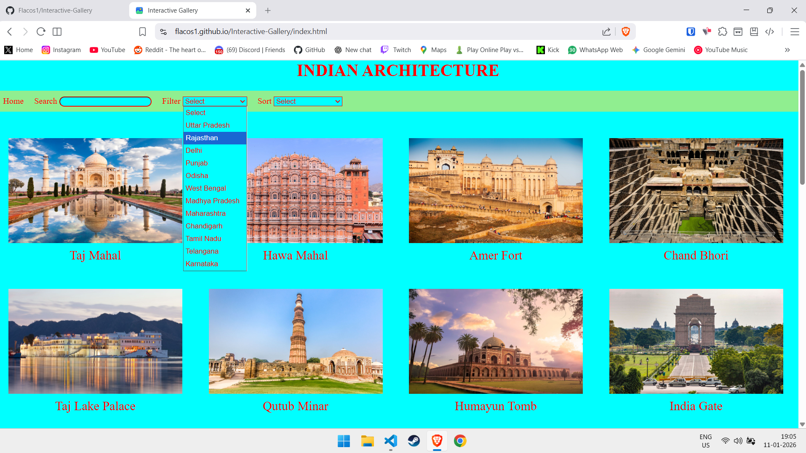
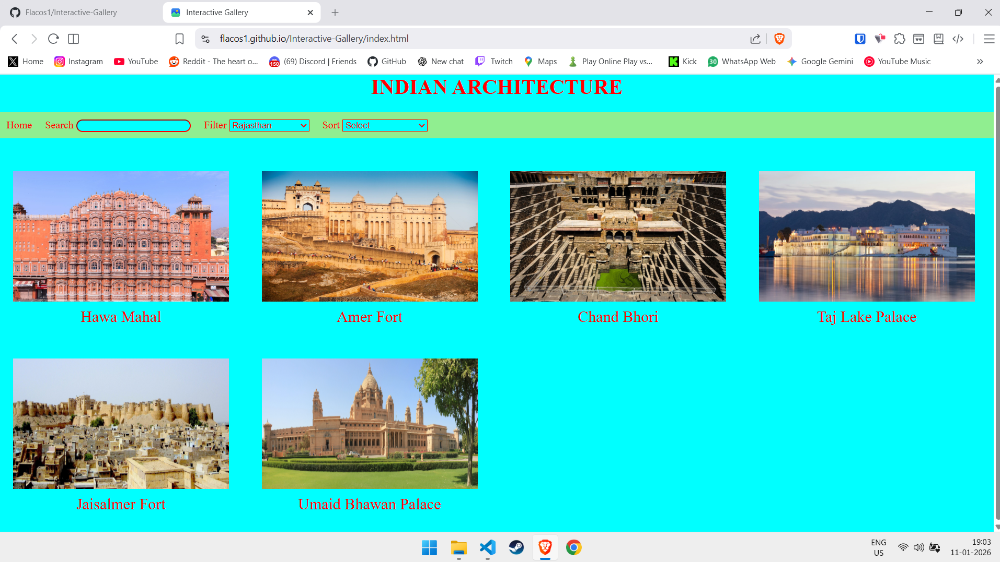
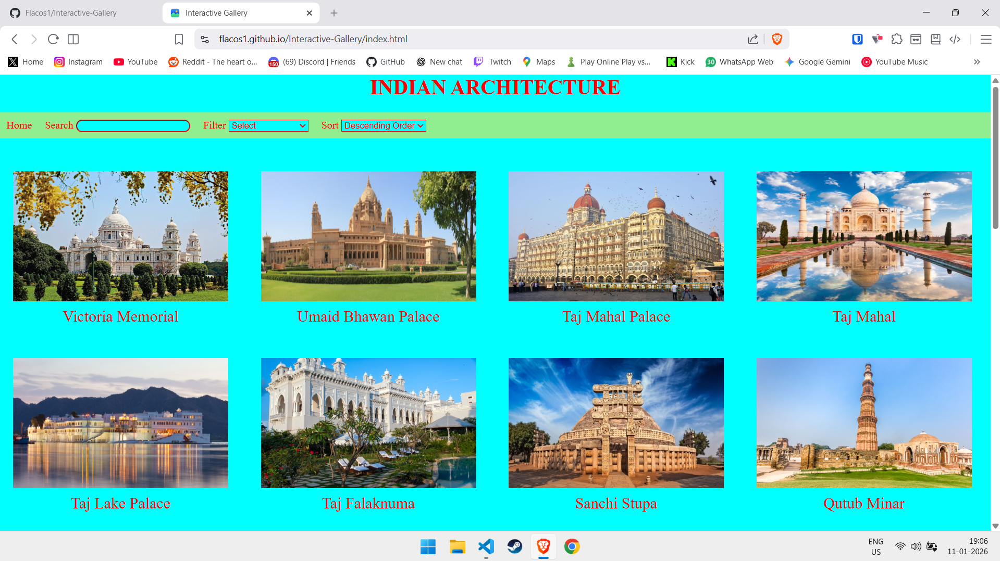

#  Indian Architecture Interactive Gallery Website
An interactive web-based gallery showcasing famous Indian architectural landmarks.
The project focuses on searching, filtering, sorting, and zooming images using pure JavaScript without any external libraries.

# Live Demo
Check out the live demo here: [Gallery Live Demo](https://flacos1.github.io/Interactive-Gallery/)

# Screenshot
**Homepage:**

**Searching:**

**Filtering:**

**Sorting:**

# Features
- Search Functionality: Search architectural landmarks by name using a dynamic search input.
- State Based Filtering: Filter monuments based on Indian states using a dropdown selector.
- Sorting: Sort the landmarks by increasing or descending order.

# Tech Stack
- HTML5 - Structure and content
- CSS3 - Styling, grid layout, and responsiveness
- JavaScript - DOM manipulation, search, filter, sort, and zoom interactions

# Getting Started
1. Clone repository  `git clone https://github.com/Flacos1/Interactive-Gallery.git` 
2. open index.html in your browser.

